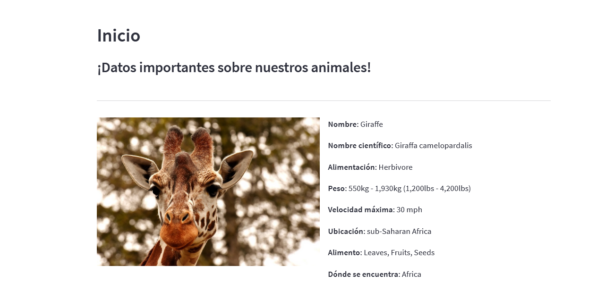
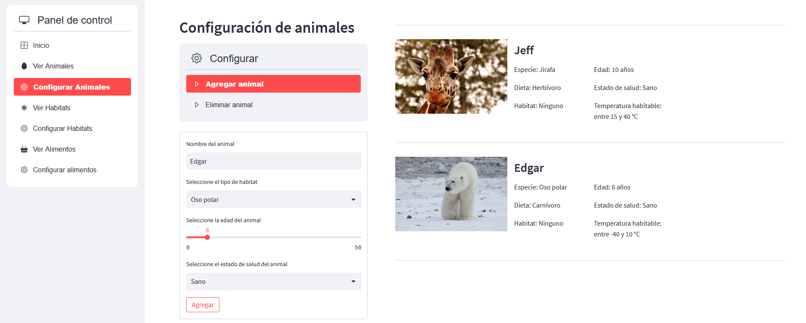
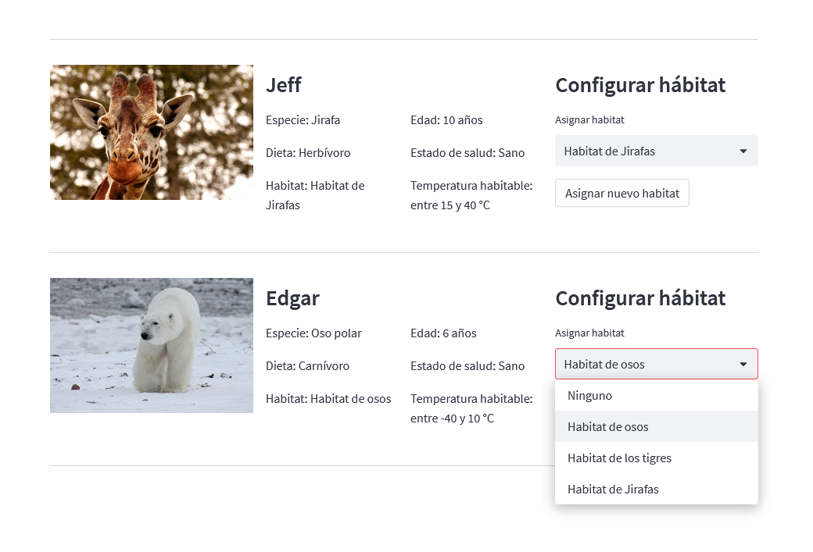
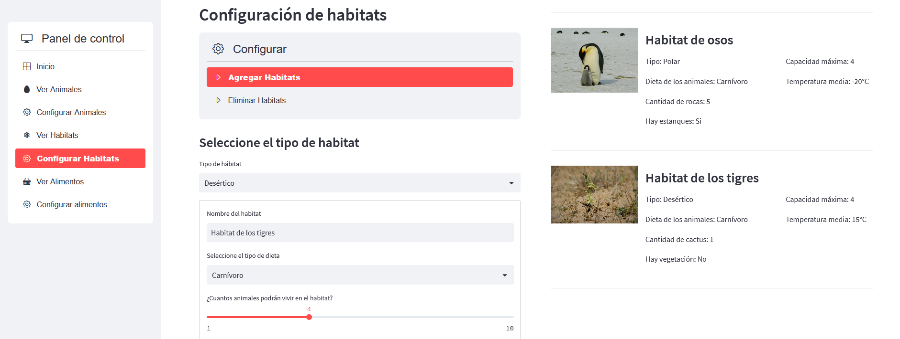
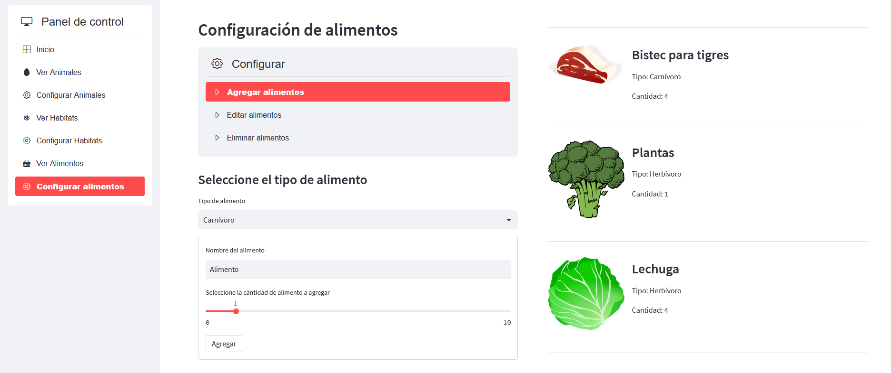

# ZooPython
## Dependencias
### Librerías Principales:

    streamlit
    streamlit_option_menu
    streamlit_image_select
    requests

Aunque hay más librerías extra que se instalan junto con las anteriores

Todas las librerías necesarias para ejecutar el proyecto están en el archivo requirements.txt para hacer más fácil su instalación.

### Instalación de librerías

Para usar el archivo requirements.txt e instalar las dependencias que se encuentran ahí, se debe ejecutar el siguiente comando en la carpeta raíz del proyecto:
    
    pip install -r requirements.txt

## Presentación

Este proyecto de final de semestre representa el panel de control de un zoológico desde el cual se pueden gestionar distintos aspectos del mismo, como los hábitats y los animales que están en el zoológico.
## Diagrama UML

En el siguiente enlace se puede encontrar el diagrama UML utilizado para realizar el proyecto:

https://drive.google.com/file/d/1FAzKFq6G-aPKpMqbox9khP1wE58Zod1-/view?usp=sharing

## Como funciona

El proyecto utiliza el framework de streamlit para mostrar un panel de control en forma de página web desde la cual se pueden controlar diversos aspectos del entorno del zoológico.
## Como ejecutarlo

Para ejecutar el proyecto, debes ejecutar el siguiente comando en la carpeta raíz del proyecto. Este comando abrirá una página en tu navegador principal en la que se podrá visualizar el panel de control del zoológico:
    
    streamlit run main.py

## Cada opción de la página

### Inicio
    
Desde esta sección se podrá ver información importante sobre los animales que pueden habitar el zoológico, esta información es obtenida mediante una API de datos de animales.

### Configurar animales

Esta opción permite tanto agregar animales con las características que el usuario desee, como eliminar los animales que ya existen en el zoológico.

Además, cuando hay hábitats disponibles, se hace visible la opción de poner al animal en alguno de los hábitats disponibles en el zoológico siempre y cuando el hábitat cumpla con las necesidades del animal.

### Configurar Habitats

Desde esta opción se pueden agregar y eliminar diferentes hábitats en el zoológico.

### Configurar Alimentos

Desde aquí se pueden gestionar los alimentos que hay disponibles en el zoológico, así como la cantidad que hay de cada alimento. Los alimentos se pueden agregar, eliminar y editar, y al editarlos se pueden renombrar, cambiar el tipo de alimento e incluso cambiar su icono simbólico, aunque el icono no es algo relevante, es meramente decorativo.

## Informe de autoevaluación

El siguiente enlace dirige al documento en donde se encuentra mi autoevaluación, los problemas que tuve, y lo que me gustó y no me gustó de la realización de este proyecto:

https://docs.google.com/document/d/1MIoqv-RS7DOPUYOqp6fWGKjcI_j_SzQKGZgSCbGj-bQ/edit

